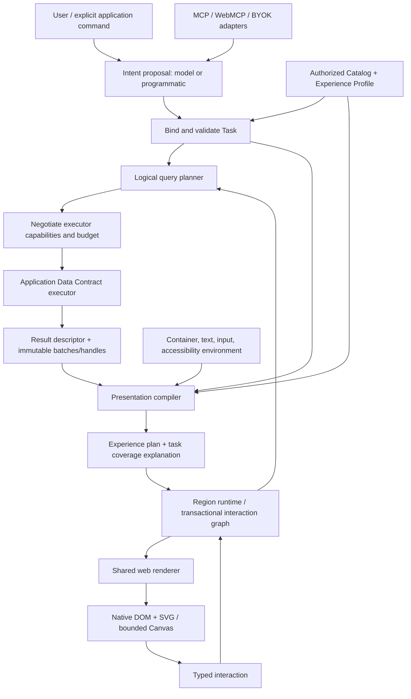

# 01 — End-to-end architecture

## Four contract families, not dozens of independent languages

Use four public, versioned documents: **Catalog**, **Task**, **Result**, and **Experience**. Expression AST, LogicalPlan and RenderPlan are internal compiler representations with explicit versions, not three extra concepts every developer must learn. They may be inspected in devtools without becoming the primary consumer API.



The feedback edge is intentional. This is not a one-shot screenshot compiler: filtering, selection, pagination, draft edits, source refresh and container changes have independent incremental paths. Most interactions never re-enter a model.

## Module responsibilities

**Contracts** define schema versions, IDs, errors, capabilities, policy types and validation. **Semantics** resolves identity, grain, units, relations and expressions. **Query** creates and verifies bounded plans; it does not fetch. **Presentation** chooses approved candidates; it does not query or own records. These are pure modules under core.

**Runtime** coordinates effects through injected ports: query, renderer, clock, scheduler, persistence, telemetry and application actions. It owns request cancellation, state transactions, caches and interaction propagation. It does not import Lit, a database driver, or a provider SDK.

**Web** owns native controls, web-specific focus/measurement/overlay behavior, geometry realization, CSS tokens, DOM updates and renderer acknowledgments. **React** adapts properties, events, lifecycle and refs to the same web elements. **Agent** projects capabilities to MCP, WebMCP or an application-owned tool-model interface. **Devtools** provides optional local inspection and authoring; it never becomes required for runtime use.

## Dependency graph

```text
contracts/semantics/query/presentation  -> core (pure)
core                                  -> runtime (ports + effects)
core + runtime                         -> web, agent, devtools, testkit
web + runtime                          -> react binding
all approved public packages           -> examples/site/local Studio
```

Arrows mean “is a dependency of,” not “imports.” Enforce the reverse actual import direction mechanically. Query and presentation share contracts, not each other's implementation. Runtime composes them; a compiler pass must not reach sideways into a renderer to infer meaning.

## State owners

| State | Owner | Identity/version |
|---|---|---|
| Business records and auth | Application backend/local app | Domain version + principal scope |
| Catalog and approved definitions | Semantic registry | Catalog revision + definition digest |
| User intent and explicit parameters | Task runtime | Task ID + task revision |
| Query result | Result store | Query key + source revision + lease |
| Region graph and view choices | Region runtime | Region ID + revision |
| Component-local hover/open state | Component controller | Stable instance key |
| Draft values | Dedicated draft controller | Entity/field key + domain revision |
| Model transcript | Agent host | Session ID; not workspace state |
| Designer profile | Experience registry | Profile revision/digest |

Avoid a global singleton. A page can mount several runtimes and several regions without sharing principals or selections. SSR creates an isolated runtime per request; static registries may be shared only if they contain no request secrets/state.

## Request lifecycle

1. Allocate a stable request ID and explicit target region/principal. Read the authorized catalog revision.
2. Bind user language or a structured request to known capabilities. Produce an actionable semantic gap when ambiguous.
3. Validate expression, grain, time, dimensions, joins, policy and cost. Resolve relative time once against an injected clock/timezone.
4. Negotiate a plan with the executor. Only accepted fragments can execute. Model-generated SQL/code is never accepted.
5. Execute with timeout, row/byte/scan budget, abort signal and source consistency context. Results arrive in bounded batches.
6. Validate result shape and metadata. Derive measured cardinality and layout hints without sending the dataset to a model.
7. Compile feasible approved experience candidates. Produce an explanation and interaction/field coverage map.
8. Stage required renderer modules and data. Commit the new region revision atomically only when its minimum display contract is ready.
9. Render progressively without falsifying completeness. Record renderer-ready separately from commit; failures retain the previous valid experience where possible.
10. Process future interaction through parameterized query/view deltas. Dispose abandoned handles, subscriptions and requests.

## Transaction model

A transaction may atomically change task parameters, graph bindings and the committed plan reference. It cannot atomically commit external database writes, npm publications, or a remote browser paint. Those have explicit receipts and independent failure semantics.

A staged plan includes catalog revision, profile revision, query/result versions and base region revision. Recheck them before commit. Stale proposals are rejected/replanned; “last response wins” is not acceptable. Publishing a new metric definition invalidates dependent plans by digest, not by arbitrary global rerender.

## Port minimization

The **Application Data Contract** covers catalog discovery and read execution. **ActionPort** is separate because domain writes have different authorization/confirmation semantics. **RendererPort** is a small platform boundary for mount/update/dispose/measure/acknowledge. Clock, scheduler, telemetry and storage are small functions, not plugin ecosystems.

Applications can implement the data contract in a few functions over an existing API. The framework includes a real local implementation and a generic HTTP client/reference server. It does not promise to infer execution logic for an unknown endpoint from sample JSON.

## Failure containment

A component exception is isolated to its view, with a fallback that still communicates failure. A source timeout invalidates only dependent results. A malformed catalog cannot enter the registry. A model response that fails validation cannot mutate a task. A permission revocation disposes authorized handles and cancels outstanding work. Log diagnostics without records/secrets by default.

## Scalability characteristics to prove

Plan work is bounded by declared candidates/nodes/dependencies. Source query work is bounded/negotiated separately. Visible rendering is bounded independently from loaded data. Cache identity includes principal/policy/catalog/source versions. Dirty propagation traverses affected dependency edges, not every component. These are requirements; benchmarks in `12-performance.md` establish whether the implementation meets them.

## Master consolidation operational paths

Four public document families remain. Internally distinguish **three graphs**: containment is an ordered tree; task/output dependencies form a DAG; interaction links carry typed events and may include only tested convergent equivalences. Never hide one of these graphs inside an arbitrary component `config`.

A data task owns named `query`/`reuse` outputs, each with an identity, dependencies, grain and delivery policy. A presentation-only task reuses results; a form task uses a trusted schema/action descriptor and drafts. A query is not required to render a button or prepare an empty form. Business execution stays an ActionPort effect, not a Task's layout side effect.

Runtime exposes evaluate/inspect independently of present. Exploratory queries remain visible in progress/devtools and are still authorized/budgeted, but do not automatically add cards. A committed experience references only selected relevant outputs. The agent host may perform several reads before proposing one coherent update.

Query planning can supply a predicted result schema for initial presentation planning. Final cardinality/quality information refines the plan without uncontrolled layout churn. Views send materialization demands (page, selected detail, prefetch, geometry resolution) to runtime. Runtime authorizes and negotiates them; query code never imports renderer code. Semantic changes such as grouping grain, population or period are explicit Task revisions, not a side effect of a narrower viewport.

### Commit preconditions

Stage with task revision, region revision, catalog/meaning/function registry versions, experience profile revision, authorized scope/policy digest, and referenced result revisions. Commit rechecks the actual read set. A newer user choice or revoked permission makes a conflicting proposal stale. Unrelated changes can be retained only by a tested rebase that proves disjoint ownership; never use last-response-wins. Render acknowledgments carry the exact committed plan/result identities.

Cross-output consistency is only as strong as the host's snapshot contract. Results from different read moments are labeled mixed/unknown consistency; do not claim one global snapshot. Hosting several queries in one Task does not manufacture a distributed transaction.

See [smartness protocol](30-smartness-operational.md) and [contract closure](31-contract-closure.md).

## Master edition 1 — canonical references

The proposal boundary receives host-owned context; binding, execute and commit are distinct effects. Formal binder outcomes and grant checks are in chapter37. Named multigrain outputs, three graph types and read-set validation remain the core operational boundaries. A passing binder is not a truth oracle.

[Master](../MASTER-SOT.md) · [AI contract](37-model-failure-containment.md) · [Release](18-release-migration.md).
