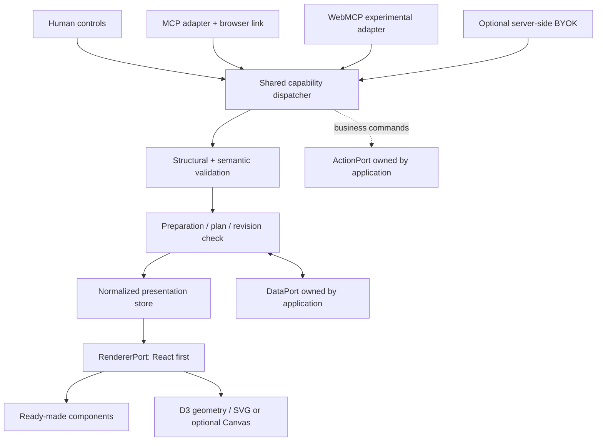

# 03 — Architecture and dependency direction

## Bentuk sistem

Manual business actions do not masquerade as presentation operations. UI-only hover, pointer position, open tooltip, and transient input can stay local; shared selection/filter/committed edits go through the appropriate dispatcher.

## Logical modules, not mandatory packages

| Module | Owns | Must not own |
|---|---|---|
| Contracts | Versioned JSON shapes, generated types/validators | UI libraries, runtime networking |
| Core | Normalized nodes, commands, revision, selectors, bounded history | React, DOM, provider SDK, data warehouse |
| Semantics | Descriptor validation, compatibility, bounded expression typing | Arbitrary joins/SQL, business truth inference |
| Planner | Registered candidates, constraints, deterministic adaptation | Agent execution, global optimization service |
| React | Render lifecycle, accessible controls, stable state boundaries | Transport or business database state |
| Visuals | D3 modules and renderer-specific geometry/interaction | Eager import of every chart, hidden aggregation |
| Data adapters | Describe/query/snapshot/cancel with capability fidelity | Owning all user application data |
| Agent adapters | Tool schemas/metadata, auth context, normalized dispatch | Separate UI logic per host |
| Docs/devtools | Examples, inspector, evidence display | Production secrets or mandatory telemetry |

Map these to existing PoC folders first. Split publishable packages only when browser/server boundaries, heavy optional dependencies, or stability levels justify it. A small project may keep contracts/semantics/planner as modules within core.

## Ports and lifecycle

`DataPort.describe()` returns immutable metadata/capabilities. `getSnapshot(binding)` returns a stable value until relevant data changes. `subscribe(binding, callback)` returns cleanup. `query(request, {signal, principalContext})` is optional, capability-gated, asynchronous, and returns completeness/provenance, not an unqualified array. Transport implementations receive principal from trusted context, never from agent-supplied fields.

`RendererPort.prepare(changeSet)` may lazy-load modules and validate that required renderer capabilities exist. `commit(snapshot)` projects state; render acknowledgments identify renderer and exact revision. `dispose()` cancels jobs and unsubscribes. Detached renderer and error boundary states have explicit receipts.

`ActionPort` contains registered business commands with schema, authorization, preview/confirmation policy, idempotency and error mapping. It is not called by a chart choosing a different representation.

## State ownership

App owns source records, auth, query cache, navigation integration, and business mutations. Core owns presentation spec, bindings/references, shared selection/filter, user pins, and bounded undo of presentation state. Component owns transient focus/hover/draft until a documented commit boundary; state that must survive reparenting is moved to a stable keyed owner.

Avoid copying source datasets into workspace snapshots. Derived caches are bounded and keyed by descriptor revision, data revision, normalized query, permission context, and any relevant sampling parameters. Caches cannot be shared across principals merely because dataset IDs match.

## Design rules

No code generation in rendering hot paths. Build validators ahead of time; the authoring schema can be sophisticated without shipping its compiler to every app. JSON Schema validates structure; semantic validators check metric units, component prop schemas, references, relations, cardinality, capabilities, and policy. [R06, R07]

React subscriptions use stable snapshots and explicit selectors. A root context carrying the whole mutable workspace would invalidate unrelated consumers; use small stable registries/context and scoped subscriptions. React's external-store semantics must be respected; a mutation wrapped in `startTransition` is not automatically nonblocking. [R08]

Asynchronous query/module preparation happens before committing a structural change, with revision recheck. Preserve existing UI while preparing; show local progress. Do not require the slowest query to block independent ready blocks. Final task completion still reports partial readiness honestly.

## Integration choices

Retain a healthy existing stack. If a dependency is absent, select it only after documenting its role: D3 modular geometry; one accessible behavior foundation; TanStack Table/Virtual in related modules only; schema compiler at build time. Ark UI/Zag is a candidate behavior foundation from v1, not a requirement to reimplement or replace every native control. [R09, R10, R11]

No Redis/Kafka/CRDT/Kubernetes/WASM/Rust requirement. Multi-user collaboration is deferred unless existing PoC already needs it. Local serialized transactions and browser reconnect are enough for the first product proof. Added abstractions must serve an existing pair of distinct use cases or enforce a critical boundary.
